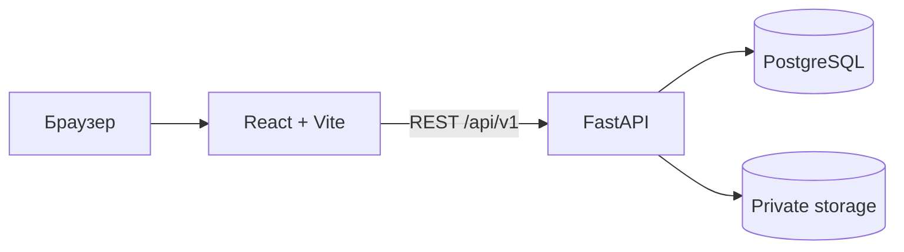
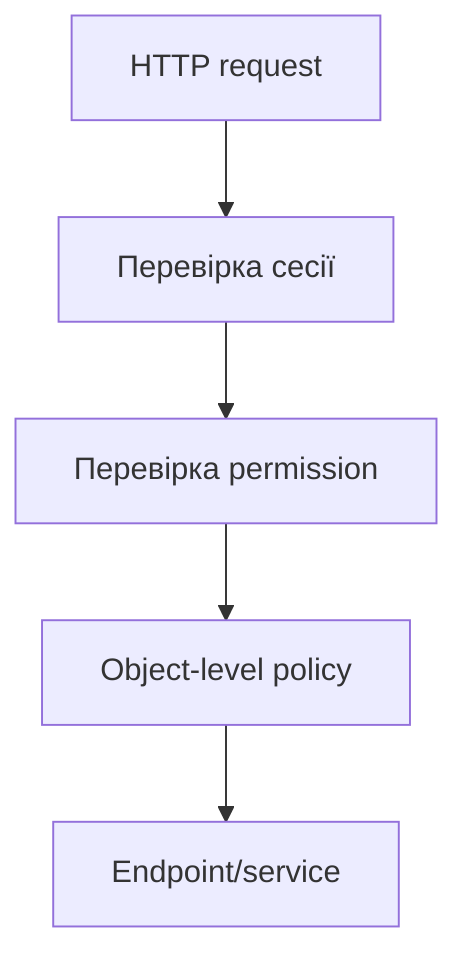

# Архітектура

```mermaid
flowchart LR
  U[Браузер] --> F[React + Vite]
  F -->|REST /api/v1| B[FastAPI]
  B --> P[(PostgreSQL)]
  B --> S[(Private storage)]
```

```mermaid
flowchart TD
  R[HTTP request] --> A[Перевірка сесії]
  A --> P[Перевірка permission]
  P --> O[Object-level policy]
  O --> E[Endpoint/service]
```

Frontend не приймає рішень про доступ: приховування елементів лише покращує UX. Остаточна перевірка виконується backend на рівні permission та конкретного об'єкта.
