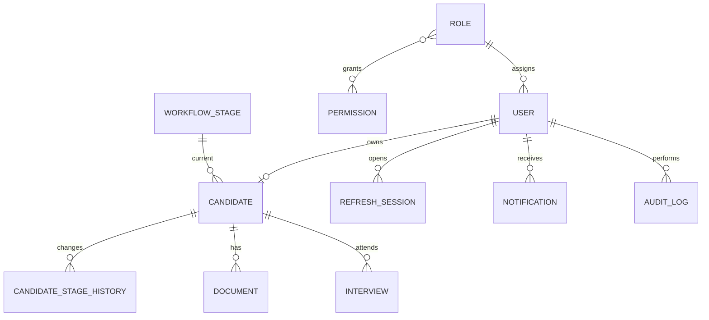

# Схема бази даних

Основні таблиці: `users`, `roles`, `permissions`, `role_permissions`, `refresh_sessions`, `password_reset_tokens`, `candidates`, `workflow_stages`, `candidate_comments`, `candidate_stage_history`, `documents`, `interviews`, `notifications`, `audit_logs`, `system_settings`.

Кандидати мають унікальні email, телефон і публічний ID. Файли фізично не зберігаються у БД. Audit log не має update/delete endpoint.
